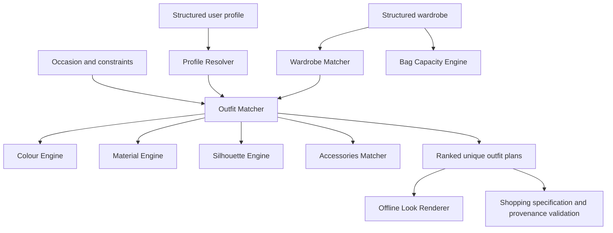

# ClothingMatching-CN Skill

**ClothingMatching-CN Skill** 是一个离线优先、可解释、以衣橱为中心的穿搭与服装决策 Skill。它面向需要从结构化衣橱、用户偏好和明确约束中获得实用搭配方案的用户；不是 Web 应用，也不是训练得到的机器学习模型。

## Key Features

- **User Profile Resolver**：将结构化或部分结构化资料规范为可预测的用户档案。
- **Fit Analysis**：基于已知身体与服装尺寸，解释不同品类的宽松量与不确定性。
- **Colour Compatibility**：分析已知颜色的关系、对比度和中性色构成。
- **Material Compatibility**：描述已知材质的纹理、结构和季节重合度。
- **Silhouette Analysis**：描述已知廓形组合，不进行身形判断。
- **Accessories Matching**：按服装上下文与显式偏好生成配饰规格。
- **Wardrobe Matching**：优先使用已有衣物，并区分精确匹配、可替代匹配和缺失项。
- **Constraint-aware Outfit Generation**：按真实衣物组合生成「上衣＋下装」或「连衣裙」方案，严格处理 `must_use_item_ids` 与 `avoid_item_ids`。
- **Explainable Ranking**：按实际组合独立计算风格、场合、颜色、衣橱覆盖和版型偏好信号。
- **Shopping Specification and Official-source Validation**：为真实缺失项生成购物规格，并验证官方来源数据契约；不执行实时商品搜索。
- **Bag Capacity and Carry-fit Estimation**：根据已知尺寸估算容量并独立判断携带物品是否可放入。
- **Optional Text-based Look Renderer**：将已有搭配方案转换为离线 fashion sketch / fashion board 文本规格与提示词，不生成图片。

## How It Works



`generate_outfits()` 不调用图片、网络或外部 API。所有输出来自本地规则、结构化 JSON 数据和已有公开接口。

## Quick Start

需要 Python 3.11+；不需要 API key、付费订阅或第三方包。

```bash
python -m unittest discover -q
python examples/run_demo.py
```

`examples/run_demo.py` 使用 `examples/user_profile.json`、`examples/wardrobe.json` 和 `examples/sample_request.json`，通过 `scripts.outfit_matcher.generate_outfits()` 输出真实的方案数、主单品 ID、评分与警告。

## Example Output

样例请求期望 3 套 `client_meeting` 搭配，并要求使用黑色宽松西装外套。样例衣橱实际只有两种唯一主单品组合，因此本地执行返回两套，而不会复制方案：

1. **Rank 1 — score `0.9633`**
   `outerwear_black_oversized_blazer` + `top_ivory_knit_shell` + `bottom_charcoal_wide_leg_trousers` + `shoes_black_leather_loafers` + `bag_black_structured_shoulder`
2. **Rank 2 — score `0.9500`**
   `outerwear_black_oversized_blazer` + `dress_navy_knit_midi` + `shoes_black_leather_loafers` + `bag_black_structured_shoulder`

实际警告：

```text
Only 2 valid unique major-item combinations are available; 3 were requested.
```

分数是可解释的启发式排序信号，不表示客观时尚质量、人体评价或商业推荐。

## Explainability and Constraints

- `must_use_item_ids` 必须来自衣橱，并放入其真实类别槽位；缺失、与禁用项冲突、同槽位冲突或连衣裙与上衣/下装互斥时会返回 `constraint_conflicts`。
- `avoid_item_ids` 会从候选组合中硬排除。
- 主搭配以 `outerwear`、`top`、`bottom`、`dress_or_one_piece`、`shoes`、`bag` 的实际 `item_id` 组合去重；更换风格名称、排序或配饰不构成新搭配。
- `requested_outfit_count` 是期望数量。有效组合不足时仅返回真实数量，并在 `warnings` 中说明。
- 每套方案独立执行颜色、材质、廓形和配饰分析，并从实际单品重新计算排序信号。
- 未知身体测量、服装尺寸、衣橱归属、容量与天气会保留为未知；系统不会补造数据。
- 决策遵循 Wardrobe First：已有衣物 → 可替代项 → 缺失项 → 购物规格。购物来源数据仅接受可验证的官方来源契约。

## Testing

```bash
python -m unittest discover -q
python -m compileall -q scripts
git diff --check
```

当前已验证的离线测试套件包含 **135 tests**。

## Current Limitations

- 使用规则型启发式，而非训练式 AI 预测。
- 结果受限于结构化衣橱的覆盖范围和元数据完整性。
- 不执行实时商品搜索或库存查询；购物组件只提供规格和官方来源验证契约。
- **不提供实际 AI 图片生成。**
- 服装尺寸分析不保证实际合身。
- 多件物品的包袋分析仅表示独立放入，不保证可同时收纳。
- 没有 Web 界面、数据库或账户系统。

## Future Roadmap

以下均为 **Planned / Not Implemented**：

- **Fashion Illustration Generation — Planned**：未来可将搭配建议自动转换为含正背面和服装细节的 fashion illustration board。
- **Broader outfit composition templates — Planned**。
- **Expanded wardrobe and style coverage — Planned**。
- **Optional official-brand shopping integration — Planned**。
- **Additional user-facing interaction methods — Planned**。

## Portfolio Value

该项目展示了：

- Python 与标准库 JSON 数据处理
- 规则型决策系统与约束处理
- 模块化架构与公共接口设计
- 可解释排序与数据验证
- 可复现的离线示例
- 自动化单元测试

当前阶段暂不接入 API 图片生成；本地搭配方案生成无需 API key。
