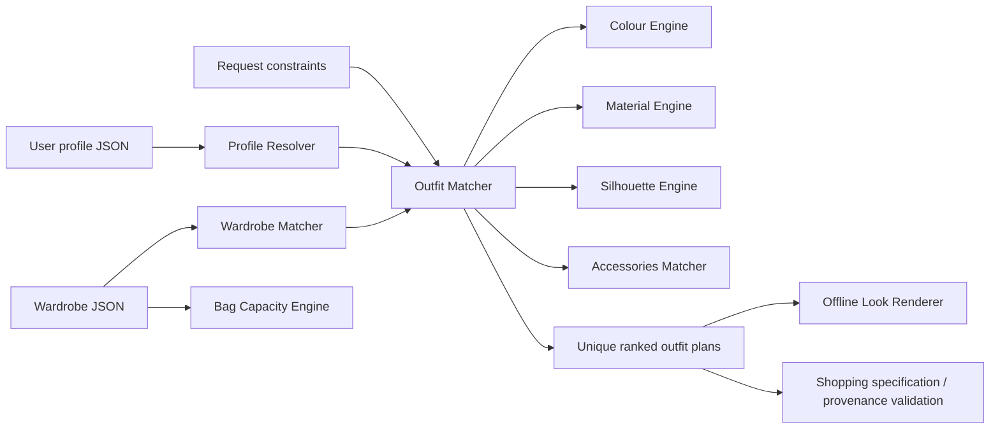

# ClothingMatching-CN Skill Architecture

## Scope

ClothingMatching-CN Skill 是离线优先的规则型穿搭决策系统。模块只消费结构化输入；没有 Web 服务、数据库、实时商品搜索或实际图片生成。

## Data flow

## Module responsibilities

| Module | Public interface / responsibility |
| --- | --- |
| `profile_resolver.py` | `resolve_profile()` validates and normalizes structured user profiles. |
| `fit_engine.py` | `analyze_fit()` compares known measurements and ease rules. |
| `color_engine.py` | Normalizes known colors and describes palette relationships. |
| `material_engine.py` | Normalizes known materials and describes visual relationships. |
| `silhouette_engine.py` | Describes known silhouette combinations without body-shape analysis. |
| `accessory_matcher.py` | `recommend_accessories()` derives accessory specifications from outfit context. |
| `wardrobe_matcher.py` | Distinguishes exact, substitute, and missing wardrobe matches. |
| `outfit_matcher.py` | `generate_outfits()` creates unique, constraint-respecting local outfit plans. |
| `shopping_resolver.py` | Builds shopping specifications and validates official-source provenance contracts. |
| `capacity_estimator.py` | Estimates capacity and independently checks carry-item fit. |
| `look_renderer.py` | Builds text-only fashion illustration specifications and prompts. |

## Interface boundaries

The Outfit Matcher returns structured JSON-like plans. It may call color, material, silhouette, and accessory modules, but does not call the renderer, shopping resolver, capacity engine, network services, or image generators. The Look Renderer remains an optional offline consumer of an existing plan.
